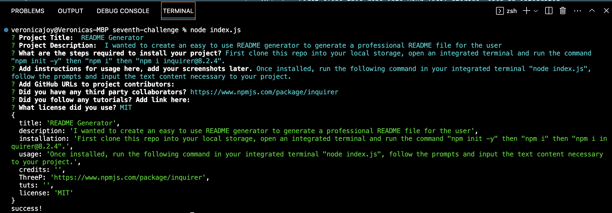

![https://img.shields.io/badge/license-${license}-blue.svg]

# README Generator

## Description

I wanted to create an easy to use README generator to generate a professional README file for the user

## Table of Contents

- [Installation](#installation)
- [Usage](#usage)
- [Credits](#credits)
- [License](#license)

## Installation

First clone this repo into your local storage, open an integrated terminal and run the command "npm init -y" then "npm i" then "npm i inquirer@8.2.4".

## Usage

Once installed, run the following command in your integrated terminal "node index.js", follow the prompts and input the text content necessary to your project.

## Credits

https://www.npmjs.com/package/inquirer

## License
MIT